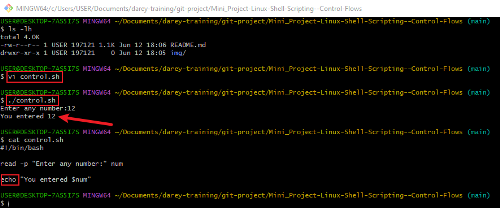
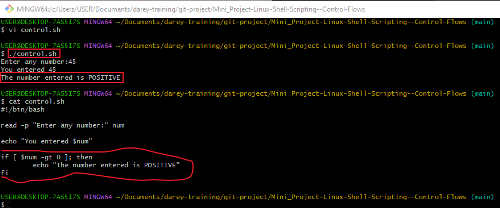
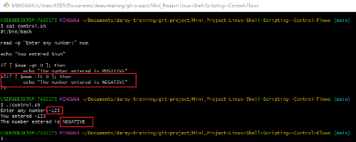
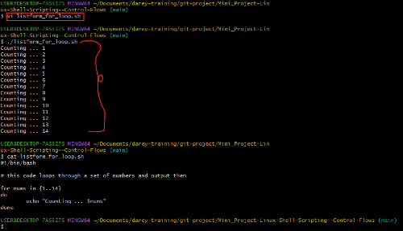
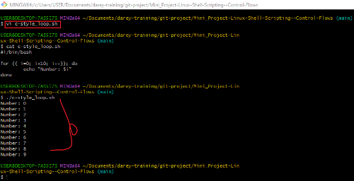

# Mini_Project-Linux-Shell-Scripting--Control-Flows

## This control flow project in scripting demonstrates my understanding of using control structures for decision-making in my scripts.

### Control flow in scripting refers to the order in which individual statements, instructions, or function calls are executed or evaluated. In scripting and programming, control flow structures dictate the path that the execution of a program follows based on certain conditions or loops. These structures allow scripts to make decisions, repeat actions, and choose different paths of execution.

### Bash and other shell interpreters provides control flow statements like `if-else`, `for loop`, `whle loops` and `case` statements to control the flow of execution in scripts.

# TASK:

- The script in the snapshot prompts for a number and then indicates whether the number is positive, negative, or zero.
1. Create a file and name it `control_flow.sh`
2. use `read` command to prompt user for input

3. use `echo` command to output the value on the screen

3. use `if` statement to test the value supplied by the user; if the value supplied is greater than zero the output should be positive.

3. use `elif` statement to test the value supplied by the user; if the value supplied is less than zero the output should be negative.

## `Loops`: They are fundamental constructs that allows us to repeat a set of commands multiple times.
### In Bash scripting, there are three primary types of loops that are commonly used to repeat a set of commands multiple times based on certain conditions.
- for 
- while &
- until

## `For Loop`: This is used to iterate over a list of values or a range of numbers. It is particularly useful when you know in advance how many times you need to execute the loop body.

# TASK
1. Create a shell script for each types of the `for loop`
2. Insert the code in the file
3. Set the correct permission for the scripts
4. Execute the script and evaluate your experience.

## Solution:
### script for `List Form`

### script for `C-style`

### The above snapshots demonstrate my understanding of using control structures for decision-making in my scripts.

